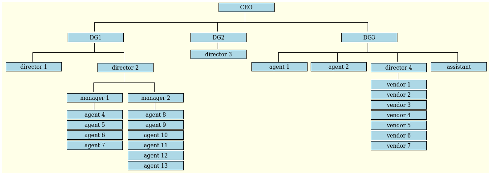

# PHP-to-OrgChart

A Organisation Chart , width Pure PHP and CSS Implement

## The initial system 
The initial built chart from a php array

## This version (felie)
This version build chart from a data file which is a list of relationship "person -- n+1"

Constraint: le top manager should be mentioned in the first relationship

    DG1 -- CEO
    DG2 -- CEO
    DG3 -- CEO
    agent 1 -- DG3
    agent 2 -- DG3
    director 1 -- DG1
    director 2 -- DG1
    director 3 -- DG2
    director 4 -- DG3
    vendor 1 -- director 4
    ...

## Screenshot
Felie: I've implement a system to replace terminal tree by **vertical blocs**

## Do you want a demo online ?

See here: https://elie.org/orgchart

## License
PHP-to-OrgChart is licensed under GPLv2 license

